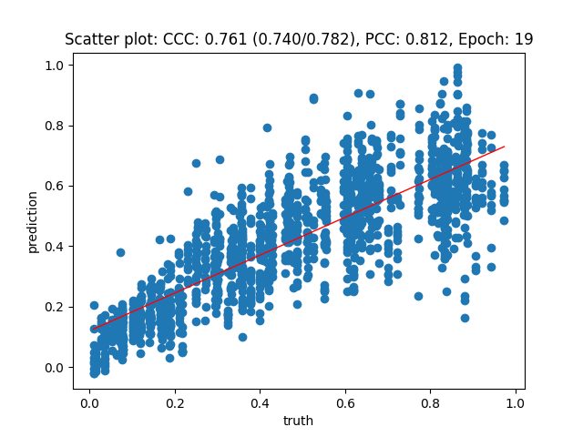
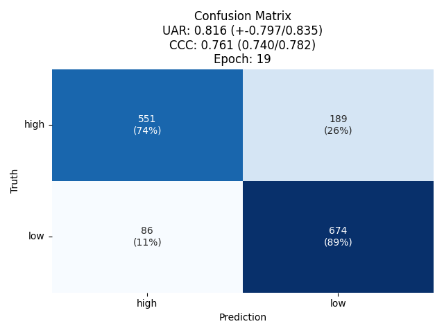

# stresssynthesis

Synthetic stress speech, generated by cloning the *prosody* of real stressed/calm
speakers onto new sentences via zero-shot voice cloning — in English and German — so
that a stress detector's training data isn't confounded with one fixed language or
script.

## Motivation

Stress-labeled speech data is scarce, and what exists is small, single-language, and
usually tied to one fixed set of scripted content — so a stress detector trained on it
can't easily be checked for whether it generalizes across **language and lexical
content**, since prosody and words are confounded in every existing recording.

**Idea:** take a real, continuously stress-labeled speech corpus and use zero-shot,
audio-conditioned voice cloning to transfer each speaker's *prosody* — not their
words — onto brand-new sentences, in more than one language. The original perceptual
stress label carries over as a proxy label for the synthetic clip. This decouples
language/content from the stress signal itself (which lives in the reference audio's
prosody), producing a continuously-labeled, multi-lingual stress dataset at zero new
annotation cost.

**Research question:** does a stress model trained only on the real, source-language
recordings still recognize stress in these voice-cloned, cross-lingual synthetic clips?
If yes, that's evidence the cloning preserves stress-relevant prosody rather than just
speaker identity/timbre.

## Method

1. **Select reference (style) samples** from a real, continuously stress-labeled speech
   corpus, spanning the full stress range (5 bins from calm to highly stressed),
   balanced for speaker diversity, restricted to a training-only partition so no
   evaluation data is touched.
2. **Synthesize new sentences** against each reference sample with a zero-shot,
   audio-conditioned TTS model ([VoxCPM](https://github.com/OpenBMB/VoxCPM)) — the
   reference audio supplies the voice/prosody, the model supplies the specific words.
   The same fixed set of sentences is used for every reference sample, in each
   language, so the design is fully crossed and comparable across languages.
3. **Copy the original perceptual stress score** onto every synthetic clip derived from
   that reference sample.
4. **Validate**: score the synthetic clips with a model trained *only* on the real
   source-language recordings (never exposed to any synthetic or cross-lingual data),
   and check whether its predictions still track the copied stress label.

## Samples

Three stress levels (low / mid / high), each synthesized in English and German from a
real reference speaker's prosody, using the same sentence content in both languages
("I need to finish the report before the meeting starts this afternoon." /
"Ich muss den Bericht fertigstellen, bevor die Besprechung heute Nachmittag beginnt."):

| Stress level | Copied stress score | English | German |
|---|---|---|---|
| Low | 0.08 | [en_low_stress.wav](samples/en_low_stress.wav) | [de_low_stress.wav](samples/de_low_stress.wav) |
| Mid | 0.46 | [en_mid_stress.wav](samples/en_mid_stress.wav) | [de_mid_stress.wav](samples/de_mid_stress.wav) |
| High | 0.82 | [en_high_stress.wav](samples/en_high_stress.wav) | [de_high_stress.wav](samples/de_high_stress.wav) |

(Stress score: 0 = calm, 1 = most stressed, on the source corpus's original perceptual
rating scale.)

## Results

A regression model trained only on the real source-language recordings — never exposed
to any synthetic or cross-lingual audio — was scored against all synthetic clips:

| Metric | Value |
|---|---|
| Pearson correlation (PCC) | 0.812 |
| Concordance correlation (CCC) | 0.761 |
| High/low classification accuracy (UAR) | 0.816 |

For reference, that same model's performance on real, native-language recordings (the
data it was actually trained on) is CCC ≈ 0.90 — so cross-lingual, voice-cloned
synthetic speech recovers most, though not all, of native-domain performance.

Per-bin, predictions track the copied label monotonically across the full stress range,
with the largest gap at the highest stress level (the model somewhat under-predicts the
most extreme stress samples) — a real but secondary limitation rather than a failure of
the approach.

## Scale

150 reference speakers/stress-levels × 10 sentences × 2 languages = 3,000 synthetic
clips total (1,500 English, 1,500 German), spanning 5 stress levels from calm to highly
stressed.

## Data provenance and license

- **Reference prosody** is cloned from **StressDat**, a Slovak speech-under-stress
  corpus (29 speakers, recorded under calming/neutral/medium/high-stress conditions,
  annotated by 5 listeners; Rajčáni et al., Slovak Academy of Sciences), restricted to
  its training partition. StressDat's own recordings are **not** included here — only
  new audio synthesized from scratch, conditioned on their prosodic style. StressDat
  itself is licensed for research use; this repository shares only the synthetic
  derivative audio described above, not the original recordings.
- **Synthesis engine:** [VoxCPM](https://github.com/OpenBMB/VoxCPM) (zero-shot,
  audio-conditioned voice cloning), via an internal TTS wrapper.
- **Sentence text** (English and German) was authored for this project — declarative,
  everyday-register, content-neutral (no emotion- or stress-coded vocabulary), so any
  stress signal in the audio comes from the cloned prosody, not the words.
- **Copied stress labels** are a proxy (StressDat's own perceptual stress score for the
  reference recording), not a new human rating of the synthetic clip itself — see
  Results above for how well that proxy holds up against an independent model.
- Downstream framework used: [nkululeko](https://github.com/felixbur/nkululeko) for
  model training/evaluation.

**The audio samples under `samples/` require the copyright holder's express prior
written consent before any use** — including research, commercial, or personal use,
and including use as training data for any model — since voice cloning can reproduce a
real, identifiable speaker's vocal characteristics even with new words. See
[LICENSE](LICENSE) for the full terms (code/documentation are more permissively
licensed than the audio itself).
